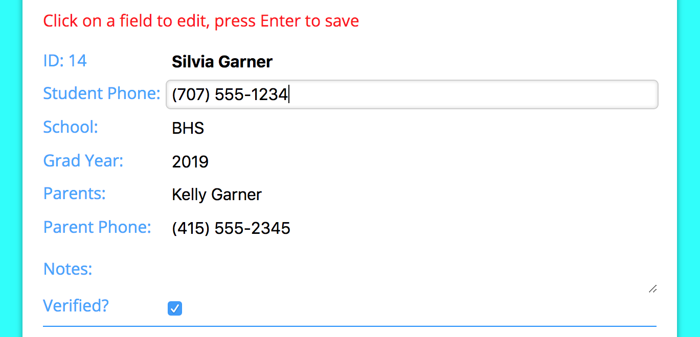

# Teen Center Log In App
A full-featured registration and log-in app for the local teen center. Students register once then sign in and sign out on the app. Administrators can run the different reports they need to apply for grants and look up and edit student info. 

**Contents**
* [Background](#background)
* [Solution](#the-solution)
* [Features](#features)
  * [Authentication](#authentication)
  * [Student-Side: Signing In](#student-side---signing-in)
  * [Student-Side: Registration](#student-side---registration)
  * [Admin-Side: Student Info](#admin-side---student-info)
  * [Admin-Side: Date Range Report](#admin-side---date-range-report)
  * [Admin-Side: Single Day Report](#admin-side---single-day-report)
  * [Admin-Side: Past Sign In](#admin-side---past-sign-in)
  * [Usability](#usability)
  * [User Feedback](#user-feedback)
  * [Style](#style)

## Background
The teen center is a great place for teens to go after school. It runs entirely on donations and grants but to apply for those grants the center needs to provide data about how many students visit over different time periods and how many total visits they get. They also need to collect some basic data about the students like their parents' phone numbers and which school they go to. Until now, students have been signing in and out on a piece of paper as they come and go. When the administrators collect the data they need for grants it sometimes takes them months to put all the info from the sign in sheets into a spreadsheet. When I built this app they were eight months behind. 

## The Solution
I built the teen center a custom app in React with a Firebase database where the kids can register with all the required information the center needs then sign in and sign out quickly with just their student id. Firebase handles the authentication making the site (and the students' data) secure. Instead of months of data entry, admin can get all the reports they need to apply for grants in under a minute! The students used to complain that signing in on the paper logs took took much time and now it only takes them a couple seconds to enter their student ID and hit enter.

## Features 

### Authentication
When admin first visits the app they see a log in screen. Admin signs in securely using Firebase's SDK authentication. Firebase looks up the user and gets their user id. Admin's UID is hardcoded into Firebase's access rules making sure that only the one user is allowed access to the site. Even if other users are somehow created they won't get to read or write data. The site also uses SSL to keep log in info and all the student info going back and forth to the database secure. If admin forgets the email there's a link that will open another view - admin enters the email on file and Firebase will send an email to reset the password. 

Log in screen and password reset screen:  

After signing in, admin chooses between the two sections of the site: the student-facing side where students can register and sign in, and the admin-facing side where they can look up student info and run reports. There's a link to the student side on the admin side, but no way to get to the admin side from the student side without logging out and back in again. I did this on purpose so that students (or anyone else who isn't authorized) can't get student data even if they have access to the sign in computer. 

Every time data is sent to or recieved, Firebase verifies the user's ID token, refreshing it if it has expired. This allows the sign in computer to stay logged in until admin logs out.

### Student Side - Signing in
The main student-facing page is the sign in page showing a list of all students who have signed in that day:   

Students can quickly enter their student ID in the input field at the top and their name and sign in time shows up in the list. Signing out is even easier - when they click "sign out" next to their name the app signs them out and displays the time they left. If a parent calls asking if their kid is there, an administrator can quickly see all students present and when they got there and left. If a kid accidentally signs someone else out by mistake they can click the erroneous signed out time which will turn it back into a sign out link. The app displays how many students are still signed in at the center and how many total students signed in that day. 

### Student Side - Registration
The top of the sign in page has the input field to sign in and next to it is a link to register. The first time the students use the app they will register with their ID and some basic contact information the center requires. All fields must be filled out and there's some light input validation, like their student ID must not be unique (since that's how they sign in and how data is gathered), names must start with a letter so they will show up in search results and graduation years must be a four digit number so they can be searched by graduation year on the admin side.

Registration form:  

After filling out all the fields students can choose to either register only or register and sign in. The "Register and Sign in" button does just that - adds their data to the database and signs them in for the day.

### Admin Side - Student Info
All data the students entered when they registered is visible to admin on the admin side of the app. Admin can click on a letter of the alphabet to see all students whose first names start with that letter, or look up which students have graduated (so they can be deleted) or see which students are unverified. Results are alphabetized by first name and paginated, with ten results to a page.

A new student is unverified until admin checks the info they entered and verifies them. Before the app, students would fill out a registration form and hand it to an administrator who would look it over. Marking a student initially as unverified lets admin easily see who has recently registered and look over their data in the same way. 

Student results are actually displayed in an edit form, but you don't see the field outlines until you scroll over the data, which keeps the results view clean and eliminates the need for a separate edit view. This makes it easy for admin to update a student's phone number or parent contact, or add notes when needed about behavior issues. Click in a field to edit it, press enter to save. If you edit a field but click away before pressing enter, the edit field will revert back to its original state, confirming that you didn't save any changes. 

Looking up students and editing their data:  

### Admin Side - Date Range Report
The most important data the teen center needs is the number of students who visit during a certain time period and how many total visits they get. This is what they use to apply for grants and was the most time consuming part of their paper system. Maybe 73 students visited a total of 629 last month but they didn't know that until they went through each line of the sign in logs and marked each student present for a particular day. Now they go to the "Date Range Report" page, enter a start date and an end date and hit "Run Report" and that data is calculated automatically for them. There's also a part below that showing the average number of students who show up each day of the week so they can plan their volunteers accordingly.

Date range report:  

### Admin Side - Single Day Report
Admin can also look up detailed logs of who visited on a particular day in the past. Maybe they need to know how many kids showed up to their last ice cream social to estimate how much ice cream to get, or if a certain student was there last Tuesday. Enter in a date and they'll get a list of students and their sign in and sign out times (and an "n/a" if the student forgot to sign in or out so they know they don't have a good sign out time for them):  

### Admin Side - Past Sign In
Like I said above, when I built this app the teen center was several months behind on converting their paper log in sheets to the data they needed, so I built them an easy way to sign up students for a previous date. Admin enters a date in one field and an ID in another. The app makes sure that ID is registered then signs the student up for that date. Afterwards, the student shows up below and the ID field clears, but the date field remains filled out, making it easy to rapidly enter different IDs in for the same date:  

### Usability 
I designed this app to be easy to use and make as few hits to the database as possible which keeps it fast and helps keep the database free for the teen center. This app will mostly be used on the teen center's Chromebooks, so I wanted users to be able to avoid using the track pad as much as possible. Every form is designed to be submitted with either a descriptive button (some people need buttons) or with the enter key for speed. On every page with input fields, the cursor automatically goes to the first field so the user can start entering data right away instead of needing the track pad to get to the field. The app is responsive and works well on a cell phone in case the internet goes out at the teen center (which happens) and they need to sign in on an administrator's phone. Any time data is displayed it follows some sort of order - either alphabetically by name when looking up students or by date (and then by name) when entering students in for a past date. On the student sign in page students are shown in alphabetical order so they can find their name quickly when signing out. I designed signing in and out to be as fast as possible (type in their ID and hit enter to sign in, click the sign out link next to their name to sign out) so the teenagers will actually use the app instead of avoid it because it takes too long or too many clicks.

### User Feedback
At every step is plenty of user feedback. Nothing happens on the site leaving the user wondering if what they did worked, and all errors are shown if something doesn't go right. If there's a problem logging in to the site, the Firebase errors are displayed:  

If the student didn't fill out all the registration fields or they are using an ID that has already been registered they get error messages:  

Once they do register a success message is shown for a brief time confirming they have either registered or registered and signed in.

If they are trying to sign in with an id that hasn't been registered yet or with an ID that has already signed in they get error messages:  

 If they are getting data for a date range and their date is badly formatted they'll get an error, if no students show up in search results they'll get a message saying there are no results instead of a blank screen. 

### Style
I designed this app to be fresh and bright. I used the [color app I built](http://katescolorpicker.surge.sh) to pick a pleasing color scheme. Buttons are nicely padded, input fields are generously sized with minimal styling, tables have slightly rounded corners - matching the slightly rounded corners of input fields and buttons. I took a lot of care to make sure little details were uniform, symmetrical, even etc. It also has a cute little favicon!  

## Wrap Up
I loved building this app. I love the process of gathering, storing and displaying data in meaningful ways, so thinking through the best ways to do that with this app was a fun challenge. I have gotten so much positive feedback from both administrators and students it makes me feel good knowing the students like using it and the administrators (mostly volunteers) have so much less work to do. 