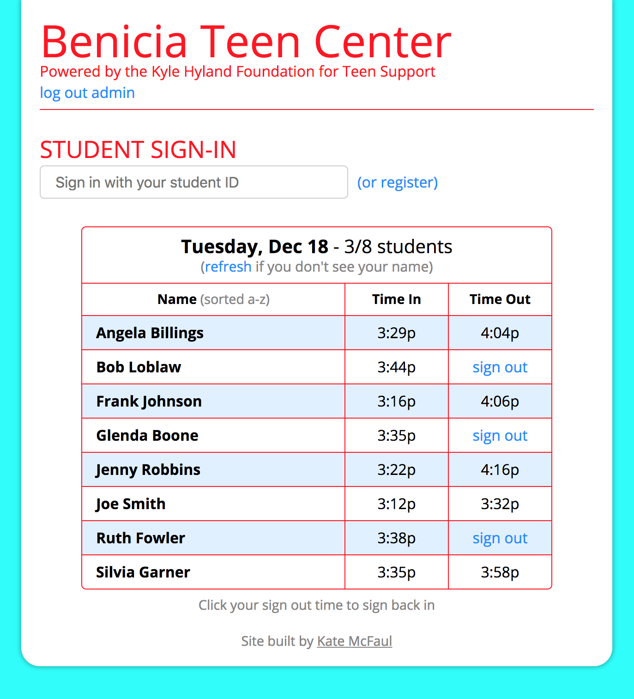
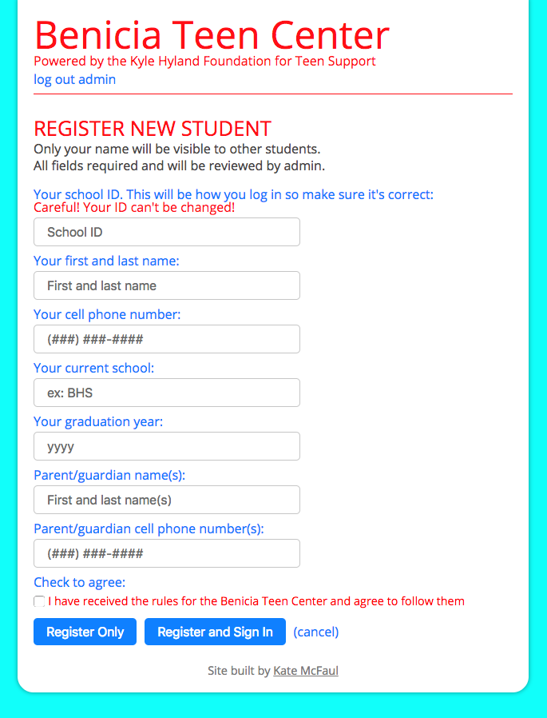
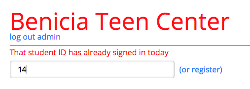

# Teen Center Log In App
A full-featured registration and log-in app for the local teen center. Students register once then sign in and sign out on the app. Administrators can run the different reports they need to apply for grants.

## Background
The teen center is a great place for teens to go after school. It runs entirely on donations and grants but to apply for those grants the center needs to provide data about how many students visit over different time periods and how many total visits they get. They also need to collect some basic data about the students like their parents' phone numbers and which school they go to. Until now, students have been signing in and out on a piece of paper as they come and go. When the administrators collect the data they need for grants it sometimes takes them months to put all the info from the sign in sheets into a spreadsheet. Right now they are eight months behind. 

## The Solution
I built the teen center a custom app in React with a Firebase database where the kids can register with all the required information then sign in and sign out quickly with just their student id. Firebase handles the authentication making the site (and the students' data) secure. Instead of months of data entry, admin can get all the reports they need to apply for grants in under a minute. 

## Features 

### Authentication
When a user first visits the app they see a log in screen. Admin signs in securely using Firebase's SDK authentication. Firebase looks up the user and gets their user id. Admin's UID is hardcoded into Firebase's access rules making sure that only the one user is allowed access to the site. Even if other users are somehow created they won't get to read or write data.

Log in screen:  

After signing in, admin chooses between the two sections of the site: the student-facing side where students can register and sign in, and the admin-facing side where they can look up student info and run reports. In order to switch between the two you have to log out and log back in again. I did this on purpose so that students (or anyone else who isn't authorized) can't get student data even if they have access to the sign in computer. 

Every time data is sent to or recieved, Firebase verifies the user's ID token, refreshing it if it has expired. This allows the sign in computer to stay logged in until admin logs out.

### Student Side - Signing in
The main student-facing page is the sign in page showing a list of all students who have signed in that day:   

Students can quickly enter their student ID in the input field at the top and their name and sign in time shows up in the list. Signing out is even easier - when they click "sign out" next to their name the app signs them out and displays the time they left. If a parent calls asking if their kid is there, an administrator can quickly see all students present and when they got there and left. If a kid accidentally signs someone else out by mistake they can click the erroneous signed out time which will turn it back into a sign out link. 

### Student Side - Registration
The top of the sign in page has the input field to sign in and next to it is a link to register. The first time the students come use the app they will register with their ID and some basic contact information. 

Registration form:  

After filling out all the fields students can choose to either register only or register and sign in. The "Register and Sign in" button does just that - adds their data to the database and signs them in for the day. All fields must be filled out and since they sign in with their student ID that number must not already be taken. 

### Admin Side - Reports
The most important data the teen center needs is the number of students who visit during a certain time period and how many total visits they get. This is what they use to apply for grants and was the most time consuming part of their paper system. Maybe 73 students visited a total of 629 last month but they didn't know that until they went through each line of the sign in logs and marked each student present for a particular day. Now they go to the "Date Range Report" page, enter a start date and an end date and hit "Run Report" and that data is calculated automatically for them. There's also a part below that showing the average number of students who show up each day of the week so they can plan their volunteers accordingly.

Before entering date range:  

After report is run:  

### User Feedback
At every step is plenty of user feedback. If there's a problem logging in to the site, the Firebase errors are displayed:  

If the student didn't fill out all the registration fields or they are using an ID that has already been registered they get error messages:  

Once they do register a success message is shown for a brief time confirming they have either registered or registered and signed in.

If they are trying to sign in with an id that hasn't been registered yet or with an ID that has already signed in they get error messages:  

Nothing happens on the site leaving the user wondering if what they did worked, and all errors are shown if something doesn't go right. 

## Coming Up
This site is still a work in progress. This is my first 7 days of work. Coming up students will be able to edit their data later when their phone number changes or they change schools. Other reports will be available like a single day report. Maybe they need to know how many kids showed up to their last ice cream social to estimate how much ice cream to get, or if a certain student was there last Tuesday. They will also be able to look up a student and get their registration info in case they need to call the parents. They will also be able to sign students in for a past date in case the power goes down and they have to use paper logs that day - but mostly I'm building this feature so they can have a quick day of getting their past data into the site for as far back as they want to go. 